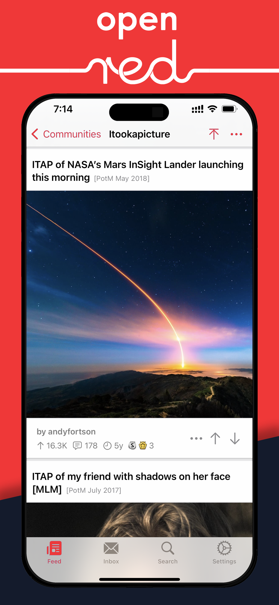
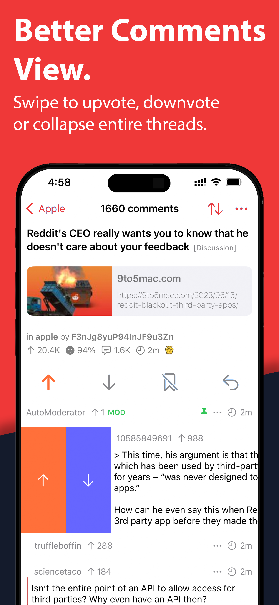
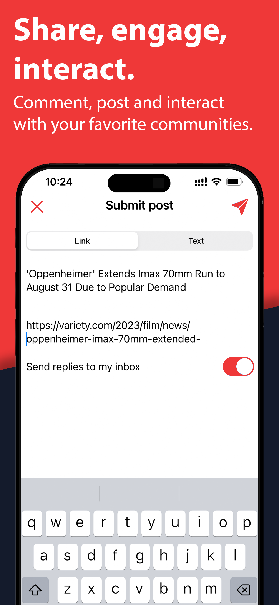
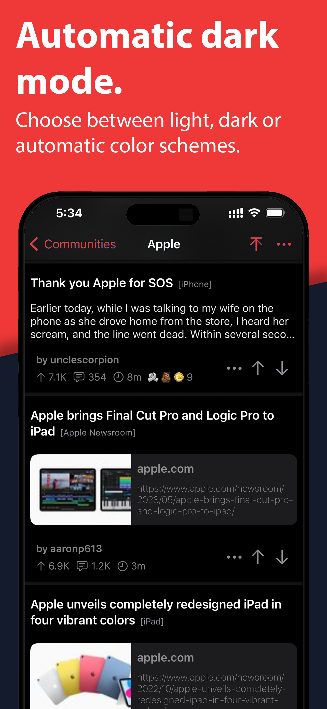
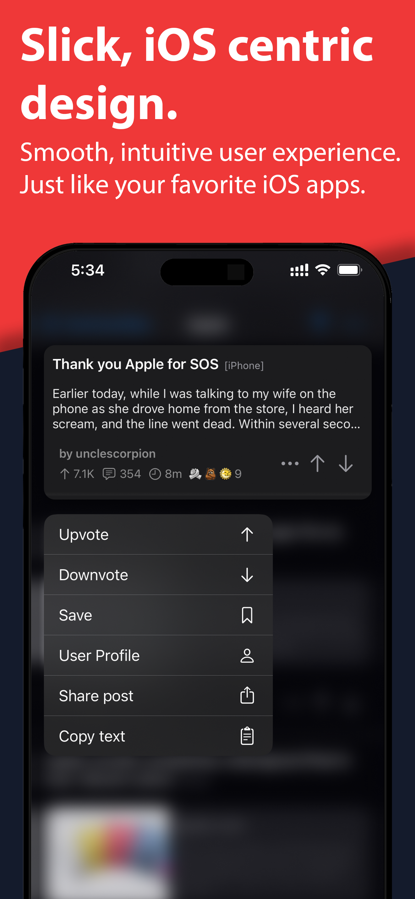
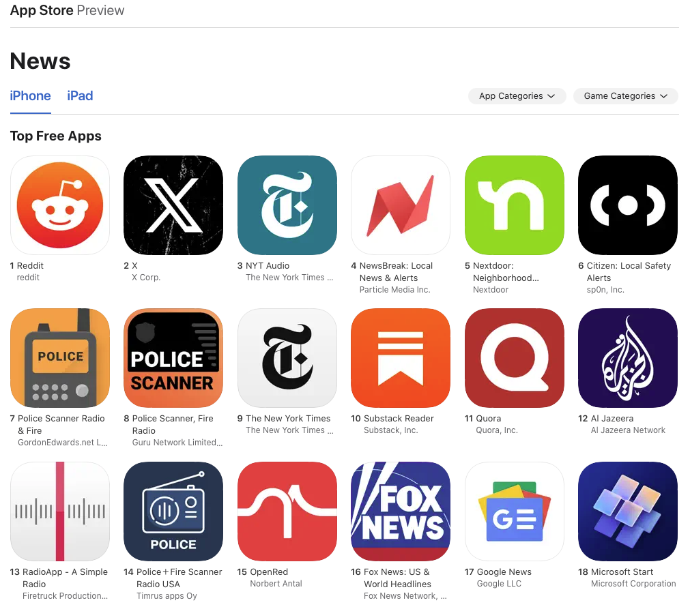

## Introduction
Openred is a reddit client for iOS that offers an alternative way to access the website after it shut down API access for third party apps. It used to be available on the App Store looking something like this:

  
  
  
  
  

> Take your reddit experience to the next level with OpenRed, the slickest reddit app for iOS.
>
> OpenRed offers a frictionless way to browse thousands of communities and make most of what the platform has to offer.
Designed to look and feel like a native iOS app, it feels right at home on your device.
>
>- Comment, post and engage with your favorite communities
>- Vote and navigate using customizable swipe actions
>- Switch seamlessly between multiple accounts
>
>For a more complete browsing experience OpenRed also offers:
>
>- Automatic dark mode
>- Custom swipe actions
>- FaceID or passcode lock
>- Custom themes and app icons
>- Compact mode
>- Tabbed interface for easy navigation
>- Inline previews of media in comments
>- Accessibility settings

  

